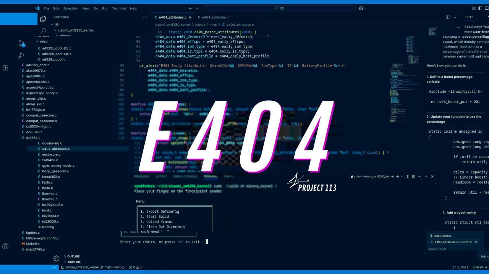

  

---

<h2 align="center">
  <a href="https://github.com/kvsnr113/e404_kernel_releases/releases"> Download & Changelogs </a>
</h2>

---

  </a>
  
  
  
  

---

## 📱 Supported Devices
- **Munch** — POCO F4 / Redmi K40S  
- **Alioth** — POCO F3 / Redmi K30S  
- **Apollo** — Mi 10T / Mi 10T Pro  
- **LMI** — POCO F2 Pro / Redmi K30 Zoom  

---

## ⚙️ Supported ROMs
- AOSP / CLO  
- MIUI / HyperOS  
- Oplus (OOS, COS, MYUI, etc.)  

---

## 🙏 Credits
- EmanuelCN0  
- Community contributors  
- All testers & participants  

---

## 🤝 Contributing

We welcome contributions to make **E404 Kernel** better!

### 🐛 Reporting Issues
- Use the [Issues](../../issues) tab to report bugs or request features.
- Please provide as much detail as possible (logs, kernel version, device, etc.).

### 🔧 Pull Requests
- Fork the repo and create a new branch for your changes.
- Make sure your commits are clear and descriptive.
- Open a Pull Request (PR) and explain what you’ve changed or improved.

### 💙 Support & Donations
Maintaining this project takes time and effort. If you’d like to support development:

  
  
  
  

- **PayPal:** [@rysie113](https://www.paypal.me/rysie113)  
- **BTC:** `2odAmmDjDUmTzwyPPaUm2Lxxhhof1EX4sCbd6KgC4e4z`  
- **ETH (ERC-20):** `0xD3267f393dDBD7eb0e9E4669166323A326051A41`
